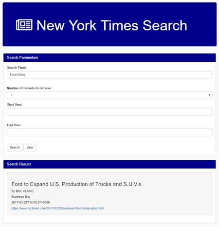

# NEW YORK TIMES SEARCH

```

The application utilizes the New York Times Article API to pull historic articles
based on search parameters.
 

```




BCS In Class Group Project

```

This project included HTML Layout Creation and was meant to introduce us to the NYT API and working with various APIs, On-Click Events + AJAX, Data Extraction from JSON, HTML Display, and Bug Handling.


This project included the following people
	
	• Simon Shih
	• Samantha Garcia
	• Shashank Ranganathan
	• James Palakkal 

```

